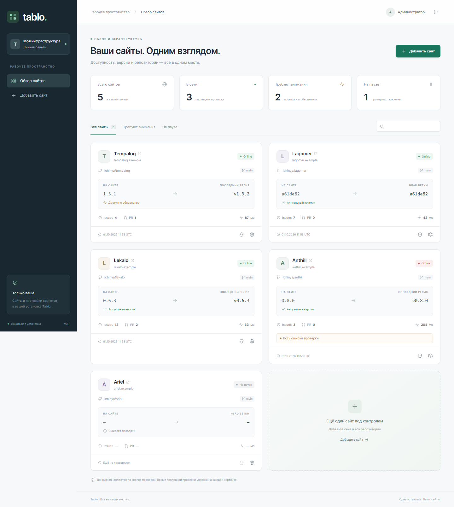
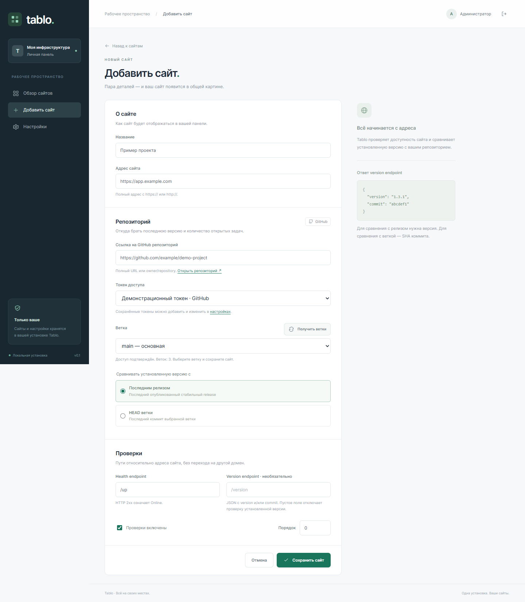
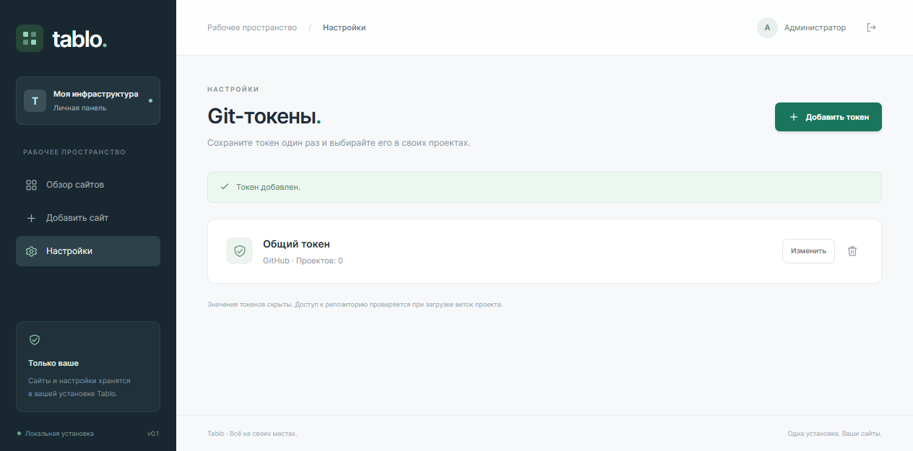
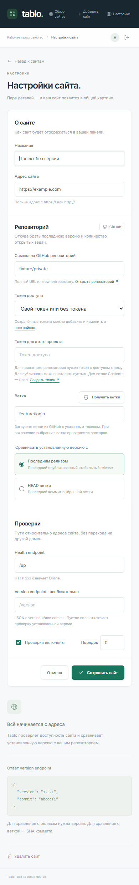

# Tablo

Небольшая self-hosted панель сайтов: доступность, установленная версия, последний
релиз / HEAD ветки, Issues, PR и время ответа. Одна установка, один администратор.

Phalcon **6.0.0 RC2**, Volt, PHP 8.2+, SQLite. Без SPA, Redis, очередей и внешнего
сервера БД. Зависимости закреплены в `composer.lock`; отдельный пакет Volt пока
использует dev-ветку, закреплённую на конкретном commit. Phalcon 6 ещё не stable.

## Скриншоты

Панель с вымышленными сайтами и результатами проверок. Скриншоты сделаны на
отдельной тестовой базе: репозитории `example/*`, домены `*.example.com` и
демонстрационный Git-токен. Реальные репозитории, пароли и токены не используются.



<details>
<summary>Добавление сайта, выбор токена и JSON-проверки</summary>



</details>

<details>
<summary>Настройки Git-токенов</summary>



</details>

<details>
<summary>Мобильный интерфейс</summary>



</details>

## Локальный запуск

```powershell
composer install
composer serve
```

Откройте <http://127.0.0.1:8087>. Если база отсутствует или в ней ещё нет
администратора, приложение перенаправит на `/setup` для создания пароля
(12–72 байта). После создания администратора `/setup` возвращает 404 для GET
и POST, включая запросы без авторизации. Начальных паролей, регистрации
и предустановленных сайтов нет.

Добавьте сайт, указав HTTP(S) адрес, GitHub репозиторий (`owner/repo` или полный
URL), токен, ветку, health path, необязательный version path и режим сравнения. «Получить ветки»
проверяет доступ к репозиторию и загружает ветки через GitHub API с этим токеном.
Выберите ветку из списка; при сохранении сервер повторно проверяет её существование.
Можно ввести ветку вручную. Тег не принимается вместо ветки.
Проверка запускается кнопкой
↻ на карточке. Изменение настроек сбрасывает старый результат; отключённые сайты
не проверяются. Поиск и фильтры работают локально поверх отрисованных карточек.

Состояния: `Online` для HTTP 2xx health и успешного условия в режиме JSON,
`Offline` для полученного ответа вне 2xx или несовпадения JSON-значения,
«Нет данных» при DNS/transport/запрете запроса или ошибке разбора JSON,
«На паузе» для отключённого сайта.
Отдельные ошибки version/GitHub не отменяют валидный health. Нет данных не
приравнивается к нулю. Проверки старше 15 минут помечаются как устаревшие.

## Endpoints сайтов

Если **Health endpoint** пустой (включая пробелы), проверяется основной URL сайта
без добавления `/up`. Базовый путь сохраняется: для `https://example.com/app`
проверяется именно этот адрес. Только полученный HTTP **200** означает `Online`;
201/204/301/302/404/500 и остальные HTTP-статусы означают `Offline`.
HTML не разбирается как JSON, сохранённые настройки JSON-проверки не применяются.
При возвращении к явно заданному endpoint настройки JSON снова действуют.

Для явно заданного endpoint в режиме **HTTP-статус** health должен вернуть HTTP 2xx; тело не проверяется.
Этот режим используется по умолчанию, в том числе для существующих сайтов.
Редиректы не выполняются. Version endpoint
необязателен и по умолчанию пустой. Без него запрос version не выполняется,
доступность и Git-метрики проверяются, а отсутствие установленной версии не
помечается ошибкой. Если endpoint указан, он должен вернуть
JSON-объект с `version` и/или `commit`:

```json
{"version":"1.3.1","commit":"a61de82"}
```

Допустимы также `deployed_version`, `deployed_commit` и `sha`. SHA — hex длиной
7–64 символа. Release сравнивается с `version` (префикс `v` нормализуется), HEAD —
с префиксом полного SHA. Отличие коммитов не доказывает, что сайт отстаёт, поэтому
панель сообщает «Коммиты различаются». Health/version paths добавляются к URL
сайта, например `https://example.com/app` + `/version`.

### JSON path версии

Если версия находится во вложенном поле, задайте **JSON path версии**, например
`$.build.version` для ответа:

```json
{"build":{"version":"1.3.1"},"commit":"a61de82"}
```

Выбранная версия должна быть непустой строкой до 200 байт. Корневые
`commit`, `sha`, `deployed_commit` продолжают определяться автоматически.
Пустой JSON path сохраняет определение `version` / `deployed_version`.
Если version endpoint пустой, запрос не выполняется и его JSON path игнорируется.

### JSON-проверка доступности

При непустом Health endpoint выберите режим **JSON-поле**, укажите путь, условие и ожидаемое
значение. Например, для `{"result":"ok","checks":{"passed":3}}`:

| JSON path | Условие | Ожидаемое значение | Проверка |
| --- | --- | --- | --- |
| `$.result` | `==` | `ok` | Точное совпадение; условие по умолчанию. |
| `$.result` | `!=` | `error` | Точное несовпадение. |
| `$.result` | `contains` | `o` | Содержит подстроку с учётом регистра. |
| `$.checks.passed` | `>` | `2` | Больше. |
| `$.checks.passed` | `>=` | `3` | Больше или равно. |
| `$.checks.passed` | `<` | `4` | Меньше. |
| `$.checks.passed` | `<=` | `3` | Меньше или равно. |

Для `==`, `!=` и `contains` сравниваются строковые представления: JSON-строка
без кавычек, число в JSON-представлении, boolean как `true` / `false`.
Пробелы ожидаемого значения сохраняются; пустая строка разрешена.
`0`, `false` и `""` считаются найденными значениями. Для `>`, `>=`, `<`, `<=`
обе стороны должны быть конечными числами или числовыми строками; допускаются
дроби, знак и экспоненциальная запись.

Сайт `Online`, когда получен HTTP 2xx и условие выполнено. Несовпадение означает
`Offline`; ответ вне 2xx также означает `Offline`, независимо от тела.
Некорректный JSON, отсутствие поля, `null`, объект, массив или нечисловое
значение в числовом сравнении дают «Нет данных» с причиной. Эти ошибки не
отменяют независимые результаты version и GitHub. Полный ответ в ошибку
не включается.

### Статусы и причины ошибок проверки

Одна политика применяется к главной странице, HTTP endpoint и JSON endpoint.
Проверка считается `Offline` при полученном неуспешном HTTP-статусе или ложном
JSON-условии. Незавершённая проверка даёт `Unknown` (в панели — «Нет данных»):
таймаут, DNS или отказ соединения могут зависеть от сети проверяющего, а SSRF,
TLS и ограничения ответа не доказывают выключение сайта. Такие результаты
требуют внимания и дают ненулевой код выхода CLI, но не объявляются `Offline`.

| Условие | Статус | `health_error_code` | Причина в панели |
| --- | --- | --- | --- |
| Главная страница: HTTP 200 | Online | `null` | — |
| Главная страница: другой HTTP-статус | Offline | `http` | HTTP-код |
| Явный endpoint: HTTP 2xx, JSON-условие выполнено либо режим HTTP | Online | `null` | — |
| Явный endpoint: HTTP вне 2xx | Offline | `http` | HTTP-код |
| Ложное JSON-условие | Offline | `json-condition` | JSON-значение не прошло условие |
| Таймаут | Unknown | `timeout` | Истёк таймаут проверки |
| Отказ соединения | Unknown | `refused` | Сервер отказал в соединении |
| Ошибка DNS | Unknown | `dns` | Не удалось разрешить DNS-имя |
| Проверка запрещена SSRF-защитой | Unknown | `ssrf` | Проверка адреса запрещена |
| Ошибка TLS | Unknown | `tls` | Не удалось установить TLS-соединение |
| Ответ больше 1 МБ | Unknown | `size` | Ответ превышает 1 МБ |
| Некорректный/обрезанный HTTP или некорректный JSON/поле | Unknown | `invalid-response` | Некорректный или неполный ответ |
| Недопустимый URL | Unknown | `invalid-url` | Недопустимый адрес проверки |
| Прочий сбой передачи/получения данных | Unknown | `network` | Не удалось передать запрос или получить ответ |
| Нераспознанный сбой проверки | Unknown | `check-error` | Не удалось выполнить проверку |

`health_http_status` хранит полученный допустимый HTTP-код, в том числе при
ошибке JSON. Если корректный HTTP-ответ не получен, поле равно `null`.
Оба поля сохраняются в SQLite, очищаются при изменении настроек и обновляются
одинаково ручной кнопкой и CLI. Причины показываются в ошибке карточки и подсказке
статуса. Старые записи получают `null` до следующей проверки; прежние ошибки
сохраняются. В причины не включаются URL, заголовки, тела ответов или текст cURL.
Сбой version или GitHub не меняет результат health и его причину.

### Синтаксис и ограничения JSON path

Пути для health и version используют один ограниченный синтаксис:

| Путь | Выбирает |
| --- | --- |
| `$` | Корневое значение. |
| `$.build.version` | Вложенное поле объекта. |
| `$.services[0].status` | Поле первого элемента массива. |
| `$["build.version"]` | Ключ с точкой. |
| `$["версия"]` | Ключ с Unicode-символами. |

После точки имя начинается с ASCII-буквы или `_` и содержит ASCII-буквы,
цифры и `_`. Остальные ключи записываются в двойных кавычках с экранированием
JSON. Индекс массива — неотрицательное целое без ведущих нулей.
Длина пути ограничена 512 байтами, ожидаемого значения — 512 символами,
глубина JSON — 16. Пути не выполняют выражения или функции и не поддерживают
wildcard, фильтры и рекурсивный поиск. Ограничения размера ответа, таймаутов
и SSRF одинаковы для обоих режимов.

При сохранении активные пути и условия проверяются на сервере; ошибка
отображается возле соответствующего поля. Изменение любого JSON-параметра
сбрасывает прежний результат и запрещает сохранение уже выполнявшейся проверки
со старыми настройками. Ручная кнопка и `php bin/check.php` используют одну
логику. Существующая SQLite получает новые поля автоматически; сайты сохраняют
режим HTTP и автоматическое определение версии.

`RepositoryProvider` — маленький контракт из четырёх методов. Реализован только
`GitHubProvider`; GitLab/Gitea/Forgejo можно добавить отдельно. Для Issues и PR
используются отдельные GitHub search-запросы; неполный ответ и лимит API
отображаются как ошибки. Latest release исключает draft/prerelease.

В разделе **Настройки → Git-токены** (`/settings`) добавьте именованный токен.
При добавлении/редактировании сайта выберите его в списке или введите токен только
для этого проекта. Один сохранённый токен можно использовать в нескольких
проектах. Его замена сбрасывает результаты их проверок; удалить используемый
токен можно после переключения проектов на другой токен. Пустое поле при
редактировании токена сохраняет прежнее значение.

Таблица `git_tokens` хранит `provider`, имя и зашифрованное значение; проект
ссылается на токен через `git_token_id`. Реестр `GitProviders` и контракт
`RepositoryProvider` позволяют добавить других Git-провайдеров. Сейчас доступен
только GitHub, адаптеры GitLab/Gitea/Forgejo пока не реализованы. Существующие
токены отдельных проектов сохраняются и продолжают работать.

Для списка веток fine-grained token
нужен доступ к выбранному репозиторию и **Contents: Read**
([документация GitHub](https://docs.github.com/en/rest/branches/branches)). Для
приватных Issues и PR также выдайте **Issues: Read** и **Pull requests: Read**.
Для публичного репозитория токен необязателен. Поле пароля администратора и поле
GitHub token — разные учётные данные.

Сохранённые и отдельные токены проектов хранятся в SQLite зашифрованными AES-256-GCM. Ключ
`github-token.key` создаётся рядом с файлом БД при первом сохранении токена. Поле
на странице редактирования всегда пустое: пустое сохраняет прежний токен, новый
заменяет его, флажок удаляет. Токен не возвращается в HTML/JSON и отправляется
только в Authorization к `api.github.com`. Загрузка веток не сохраняет токен или
сайт. Список загружается постранично по 100; при превышении лимита 10 страниц
или времени запроса выводится ошибка, и ветку можно указать вручную.

## Настройки

PHP автоматически загружает `.env` из корня проекта при запуске web и CLI через
Composer autoload. Переменные, уже заданные в окружении процесса, имеют приоритет.
Отсутствие `.env` допустимо: используются окружение и значения по умолчанию.
После изменения `.env` перезапустите долгоживущий PHP-процесс или воркер.

Пример:

```dotenv
TABLO_DB="D:/data/tablo.sqlite"
TABLO_ALLOW_PRIVATE_NETWORK=0
TABLO_COOKIE_SECURE=0
```

Для Windows используйте прямые слеши либо одинарные кавычки для путей с обратными
слешами. Относительный путь к БД считается от рабочего каталога PHP-процесса;
при запуске из другого каталога задайте абсолютный путь.
Docker Compose читает `.env` для подстановки значений; в контейнер передаются
переменные из `environment` в `compose.yaml`. Локальный `.env` не включается в образ.

| Переменная | Значение |
| --- | --- |
| `TABLO_DB` | Путь к SQLite; по умолчанию `storage/tablo.sqlite`. |
| `TABLO_ALLOW_PRIVATE_NETWORK` | `1` для осознанного мониторинга localhost/private сетей; по умолчанию `0`. |
| `TABLO_COOKIE_SECURE` | `1` при работе через HTTPS reverse proxy. Прямой HTTPS определяется автоматически. |

По умолчанию health/version запросы запрещают private/reserved IP, фиксируют
разрешённый DNS-адрес на время запроса, не используют proxy из окружения и не
выполняют редиректы. Ответ ограничен 1 МБ; connect timeout 3 с, HTTP timeout 6 с.
Токен GitHub передаётся только `api.github.com`. Для TLS проверяется сертификат.

Для регулярной проверки всех включённых сайтов:

```powershell
php bin/check.php
```

Запускайте эту команду своим cron/Task Scheduler с теми же переменными окружения.
Проверки последовательные; интервал выбирайте с учётом числа сайтов и лимита
GitHub search API. Код выхода `1` означает ошибку, Offline или изменённые во время
проверки настройки. Отдельная история проверок пока не хранится.

## Миграции SQLite

Версия схемы хранится в `PRAGMA user_version`. При первом подключении пустая
или совместимая старая база с версией `0` автоматически обновляется до версии `2`.
База версии `1` получает только новый переход: nullable `health_error_code` и
`health_http_status`; существующие сайты, endpoints и результаты сохраняются.
Создание таблиц, добавление недостающих колонок и запись номера версии выполняются
в одной транзакции. При ошибке переход откатывается; повторное подключение может
повторить его. Пароль администратора, сайты, ключ шифрования и сохранённые токены
при обновлении не заменяются.

Для актуальной схемы мигратор только читает номер версии: не выполняет DDL и не
запрашивает блокировку записи. При одновременном запуске процессы повторно проверяют
версию после получения блокировки, поэтому уже выполненный переход пропускается.
База с более новой версией или несовместимой старой структурой вызывает ошибку
без изменения данных; не снижайте `user_version` вручную для запуска старого приложения.

`database/schema.sql` — фиксированный bootstrap версии `1`. Будущие изменения
добавляются отдельными переходами в мигратор с увеличением номера версии.
Режим журналирования этой миграцией не меняется. Тесты миграций входят в наборы
`Unit` и `Network`, включая запуск двух PHP-процессов и ошибки SQL.

## Docker

```powershell
docker compose up --build -d
```

Адрес тот же: <http://127.0.0.1:8087>. Контейнер использует Apache и PHP, данные
хранятся в именованном томе `tablo-data`. Перед запуском остановите локальный PHP
сервер, если он занимает этот порт. Для публикации используйте HTTPS reverse
proxy и `TABLO_COOKIE_SECURE=1`. DocumentRoot всегда должен указывать на `public/`.

Создайте администратора при первоначальной локальной настройке до публикации.
Резервируйте SQLite в отсутствие активных записей или SQLite backup API; вместе
с БД сохраняется хеш пароля. Если используются токены сайтов, обязательно
сохраняйте также `github-token.key`: без него прежние токены нельзя расшифровать.
Сессии можно не переносить. Существующая БД обновляется автоматически без сброса
сайтов и администратора. Исходники, SQLite, .env
и зависимости не должны быть доступны из web root.

## Локальная смена пароля администратора

Существующего администратора меняет локальная команда `bin/admin-password.php`.
Сервер может работать: строка администратора 1 присутствует непрерывно, а
GET/POST `/setup` остаются 404 до, во время и после смены или отката.
Если SQLite не допускает новое чтение (например, PENDING lock при ожидании
COMMIT), запрос может получить существующий HTTP 500 по ошибке хранения;
форма setup при этом не открывается. Гарантия 404 предполагает доступное чтение БД.
Команда обновляет только хеш пароля; ID, created_at, схема, сайты, результаты,
зашифрованные Git-токены и байты ключа сохраняются. Ключ не читается и не создаётся;
его отсутствие или недоступность не мешают смене пароля. Файлы сессий не удаляются.
Не удаляйте администратора, SQLite или ключ для восстановления доступа.

Сначала проверьте выбранную установку из корня нужного проекта:

```powershell
php bin/admin-password.php --show-installation
```

Вывод содержит канонический путь **фактически открытой** БД, ID администратора и
версию схемы; управляющие символы пути экранированы. Разрешение пути прежнее:
явный путь в database API, затем process `TABLO_DB`, корневой `.env` без
перезаписи process environment, иначе `storage/tablo.sqlite`. Относительный
TABLO_DB зависит от рабочего каталога. Поддерживаются существующие файловые URI.
Read-only/memory URI, в том числе с percent-encoded параметрами, и включённые или
неоднозначные immutable/nolock отвергаются: смене нужны запись и блокировки SQLite.
Явные false/0/off/no для immutable/nolock допустимы; исходный URI передаётся PDO без переписывания.
При повторных параметрах любое read-only/memory или unsafe значение отвергается,
чтобы не полагаться на разные правила выбора повторов SQLite core и VFS.
CLI не создаёт БД/каталоги, не выполняет миграцию, chmod или смену journal mode.
Отсутствующая/временная/повреждённая/непригодная БД, несовместимая схема, неверная
таблица users или отсутствующий администратор дают отказ. Старую схему обновите
отдельно обычным поддерживаемым запуском приложения; команда восстановления
не является способом миграции. Backup/restore и замена файла работающей БД
требуют отдельной координации оператора.

Windows PowerShell 5.1 или PowerShell 7: скрытые запросы и прямой UTF-8 stdin.
Запускайте helper из нужной установки; пароль не передаётся через аргументы,
переменные окружения, PowerShell pipeline или JSON.

```powershell
powershell -NoProfile -File tools/admin-password.ps1
# PowerShell 7, если установлен:
pwsh -NoProfile -File tools/admin-password.ps1
```

Helper использует SecureString, UseShellExecute=false и StandardInput.BaseStream.
Он освобождает BSTR через ZeroFreeBSTR, очищает временные char/byte buffers и
возвращает exit PHP/Docker. Это не гарантия стирания всех копий в управляемой
памяти. Ctrl+C на запросе не запускает дочернюю команду; при прерывании уже
переданных данных сначала проверьте обычный вход: COMMIT мог успеть завершиться.

Linux **Bash** (read -s не является переносимым sh):

```bash
php bin/admin-password.php --show-installation
bash tools/admin-password.bash
```

Bash helper отключает xtrace до ввода, использует IFS= read -r -s из /dev/tty,
посылает две строки через встроенный printf и возвращает exit команды.
EXIT/INT/TERM очищают переменные; отмена запроса не запускает CLI. Не включайте
трассировку или запись секретов в своём producer. У автоматизации пароль должен
поступать из защищённого источника прямо в stdin, без литералов в командах,
истории, argv, логах или файлов общего доступа.

Протокол `--password-stdin`: ровно две UTF-8 строки (пароль и подтверждение),
каждая заканчивается LF или CRLF, затем EOF. Только окончания строк удаляются;
пробелы сохраняются. TTY, BOM, NUL, лишние/незавершённые строки, неподдерживаемая
кодировка/framing, несовпадение и переполнение дают отказ. Общая web/CLI проверка:
12–72 **байта**, точное подтверждение без trim, PASSWORD_DEFAULT и случайная соль.
Пароли с переводом строки допустимы общей web-проверкой, но не представимы
в этом отдельном stdin-протоколе. Команда не может проверить безопасность
стороннего producer.

Docker Compose использует БД подключённого тома установки, а не локальную storage.
В текущем образе PHP работает как www-data (UID 33); команды выполняйте от того
же пользователя, без публикации дополнительных портов и без удаления тома.
Выберите правильный Compose project/конфигурацию до preflight:

```bash
docker compose exec -T --user www-data tablo php bin/admin-password.php --show-installation
bash tools/admin-password.bash Docker
# Если служба уже остановлена:
docker compose run --rm --no-deps -T --user www-data --entrypoint php tablo bin/admin-password.php --show-installation
bash tools/admin-password.bash DockerStopped
```

Для Windows тот же защищённый ввод и фиксированный Docker argv:

```powershell
powershell -NoProfile -File tools/admin-password.ps1 -Mode Docker
# Если служба уже остановлена:
powershell -NoProfile -File tools/admin-password.ps1 -Mode DockerStopped
```

Helper передаёт stdin в `docker compose exec -T --user www-data tablo php
bin/admin-password.php --password-stdin` либо в `docker compose run --rm
--no-deps -T --user www-data --entrypoint php tablo bin/admin-password.php
--password-stdin`. Stopped-service вариант подключает тот же том, не запускает
зависимости и не публикует service ports. Останавливать работающую службу ради
смены пароля не требуется. См. [Compose exec](https://github.com/docker/compose/blob/main/docs/reference/compose_exec.md)
и [Compose run](https://github.com/docker/compose/blob/main/docs/reference/compose_run.md).

Выбранный хеш фиксируется **до** stdin. Два процесса с одним старым снимком
не перезаписывают результат друг друга: один завершится успешно, другой получит
конфликт/занятость. Намеренная последующая смена с новым снимком допустима.
Тот же текущий пароль и повтор завершённой смены дают отказ без перехеширования.
Нет автоматического повторного захвата снимка или retry. Валидация/хеширование
происходят до BEGIN IMMEDIATE; собственная незавершённая транзакция откатывается
при ошибке. Ошибка rollback, смерть процесса или потеря вывода после COMMIT
не дают гарантии прежнего состояния: проверьте обычный вход перед новой попыткой.

Прежние пароли перестают проходить проверку, а старые сессии отклоняются перед
каждым следующим защищённым GET/POST (включая старый CSRF). Сессии содержат только
доменный производный маркер, не хеш пароля. Legacy-сессии без маркера после
обновления потребуют входа. Вход, проверивший старый пароль до COMMIT, может
создать cookie позднее, но оно будет отклонено на следующем защищённом запросе.
Rehash привязывает вызывающую сессию к её собственному новому хешу и отзывает
предыдущие снимки. Уже допущенная работа может завершиться; ретроактивная отмена
не обещается. Cookie, CSRF и срок сессии 12 часов сохраняют прежнюю политику.

CLI не меняет ни одной строки login_limits. Заблокированный адрес остаётся
заблокированным до конца своего существующего окна 900 секунд даже с новым
паролем. Незаблокированный клиент может войти; обычный успешный вход очищает
только собственную корзину (сохраняется обычная очистка истёкших окон).

Коды завершения: 0 — COMMIT/preflight/help; 2 — invocation/input/password;
3 — непригодная установка/администратор/схема; 4 — busy/stale conflict;
1 — storage/unexpected error. stdout содержит выбор и статус, stderr — только
фиксированную безопасную ошибку. Пароли, DSN/query, конфигурация, токены, ключи,
хеши и маркеры не выводятся. `--help` перечисляет единственные допустимые режимы.

## Работа через Lekalo

Проект создан командой `lekalo init --target php --project-id tablo --module dashboard`.
Первичная модель находится в `lekalo/`, воспроизводимое разрешение — в
`lekalo.lock`. Закреплённая версия CLI — **0.6.3**. Команды, сущности и сценарии
связаны с поддерживаемой реализацией через `contracts/php-bindings.json`.

```powershell
composer verify
```

Проверка запускает:

1. `lekalo validate --no-cache` и `lekalo lock --check --offline`;
2. проверку сохранённых SHA256 исходников;
3. регистрацию сохранённых bindings и привязку native tests;
4. `lekalo contract check --module dashboard --no-cache`;
5. три набора Testo: Unit, Network (реальные локальные cURL проверки JSON,
   редиректов, размера ответа и таймаутов) и Http (независимые HTTP-сценарии).

При необходимости задайте `LEKALO_BIN` полным путём к CLI. Результат успешного
запуска сохраняется в `artifacts/verification.json`.

После осознанного изменения модели/реализации обновляйте declaration отдельно:

```powershell
php tools/capture-bindings.php
# Просмотрите изменения contracts/php-bindings.json.
composer verify
```

Capture фиксирует канонические контракты, source locations и fingerprints;
это локальная декларация проекта, а не полноценный Phalcon target adapter
или анализатор тел PHP. Runtime-семантика подтверждается native tests. Проверка
никогда сама не пересоздаёт fingerprints. Встроенный PHP/Laravel adapter Lekalo
не используется для Phalcon. Грамматика endpoint в текущем Model не принимает
корневой `/`, поэтому dashboard описан query `dashboard.list_sites`, без
вымышленного transport endpoint. Остальные POST endpoints есть в модели.

## Тесты и CI

Используется Testo **0.10.54**, закреплённый в `composer.lock`. Для разработки
устанавливайте зависимости обычным `composer install`, включая dev-пакеты.
Composer разрешает зависимости для PHP 8.2; `composer check-platform-reqs`
проверяет фактический PHP и расширения вашей установки.

Одинаковые команды работают в PowerShell на Windows и в shell на Linux:

```powershell
composer test
php vendor/bin/testo run --suite=Unit
php vendor/bin/testo run --suite=Network
php vendor/bin/testo run --suite=Http
composer verify
```

`composer test` запускает все три набора без Lekalo. `composer verify` дополнительно
проверяет модель, lock и bindings. Любая ошибка возвращает ненулевой код выхода.
Наборы определены явно в `testo.php`: вспомогательные классы и router/fixture
скрипты не запускаются как тесты.

HTTP-тесты используют синтетические пароли и токены, отдельные временные SQLite,
ключи шифрования, cookies, сессии и кэш Volt. Серверы слушают свободные локальные
порты; сервер, соединения SQLite и временные каталоги закрываются после каждого
теста, включая ошибки. `storage/`, текущий администратор и рабочие токены
установки не используются. Запросы к GitHub заменены тестовым transport;
настоящий токен GitHub для тестов не нужен.

GitHub Actions запускает полный `composer verify` на push и pull request для
Linux и Windows с PHP 8.2, 8.4 и 8.5. Lekalo собирается из коммита
`9510dd0767a56c0ab34b8d3c8ceb2a14db8de825` тега
[`v0.6.4`](https://github.com/ichinya/lekalo/tree/v0.6.4), который выпускает CLI
0.6.3; сборка кэшируется отдельно для каждой ОС. Lock не обновляется в CI.

### Запуск тестов в Docker

Следующий пример PowerShell использует текущий производственный образ PHP 8.4
как среду выполнения. Исходники подключаются read-only; во временный каталог
одноразового контейнера копируются только код, схема и тестовые фикстуры.
Рабочие `.env`, SQLite, ключи и `vendor/` не копируются. Dev-зависимости
устанавливаются внутри контейнера и не попадают в производственный образ.

```powershell
docker build -t tablo:test-runtime .
if ($LASTEXITCODE -ne 0) { throw 'Docker build failed.' }
$testInContainer = @'
set -eu
mkdir /tmp/tablo-tests
cp -R /source/app /source/bin /source/public /source/views /source/database /source/tests /source/composer.json /source/composer.lock /source/testo.php /tmp/tablo-tests/
cd /tmp/tablo-tests
composer install --no-interaction --prefer-dist
composer test
'@
docker run --rm --mount "type=bind,source=$PWD,target=/source,readonly" --entrypoint sh tablo:test-runtime -lc $testInContainer
if ($LASTEXITCODE -ne 0) { throw 'Docker tests failed.' }
```

На Linux после той же сборки:

```sh
docker run --rm --mount "type=bind,source=$PWD,target=/source,readonly" \
  --entrypoint sh tablo:test-runtime -lc '
set -eu
mkdir /tmp/tablo-tests
cp -R /source/app /source/bin /source/public /source/views /source/database /source/tests /source/composer.json /source/composer.lock /source/testo.php /tmp/tablo-tests/
cd /tmp/tablo-tests
composer install --no-interaction --prefer-dist
composer test
'
```

`tests/browser-fixture.php` по умолчанию создаёт `artifacts/browser.sqlite` с явно
синтетическими данными для визуальной проверки; он не меняет основную установку.
Для отдельного каталога передайте путь явно, например:

```powershell
php tests/browser-fixture.php artifacts/screenshots-demo/browser.sqlite
```

Фикстура содержит только вымышленные проекты `example/*` и демонстрационный токен.
Для визуальной проверки используйте `tests/web-router.php` с `TABLO_DB`, указывающим
на эту БД, и `TABLO_TEST_RUNTIME`, указывающим на отдельный каталог сессий и кэша Volt.
Этот router подменяет GitHub API фикстурой; реальный GitHub-токен не нужен.
